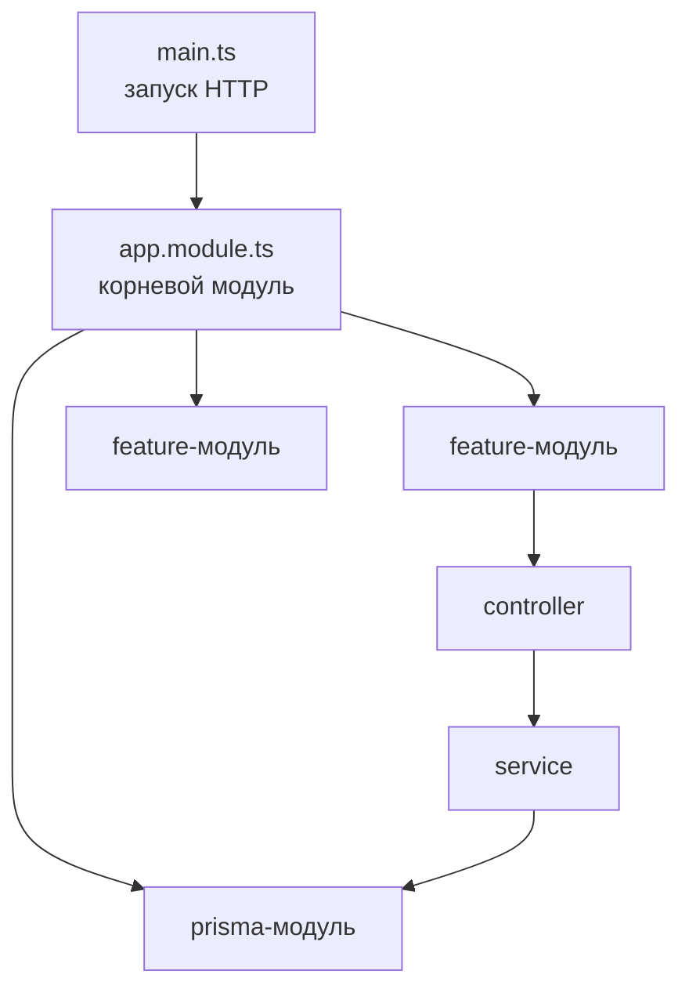

# Архитектура и навигация по проекту

## §1 Стек и окружение

Монолитный HTTP API: один backend-сервис, домен по модулям в `src/modules/`.

| Область     | Стек                                                         |
|-------------|--------------------------------------------------------------|
| **Runtime** | NestJS 11, TypeScript, Express                               |
| **Данные**  | PostgreSQL 17, Prisma 6 (`prisma/schema/`, `prisma migrate`) |
| **Конфиг**  | `@nestjs/config`, `.env`                                     |
| **БД**      | `PostgreSQL`                                                 |
| **Инфра**   | Docker Compose (`api`, `database`)                           |
| **Тесты**   | Jest (unit + e2e), пороги и отчёты в CI — см. README         |

---

## §2 Карта репозитория

```
hackaton-backend-prod-2025/
├── src/
│   ├── main.ts                 ← старт, ValidationPipe, префикс /v1, Swagger
│   ├── app.module.ts           ← список всех модулей
│   ├── app.controller.ts       ← GET /health
│   │
│   ├── modules/                ← БИЗНЕС-ЛОГИКА (по фичам)
│   │   ├── auth/               ← вход, JWT, guards
│   │   ├── users/              ← профиль: теги, контакты
│   │   ├── events/             ← события, регистрация, лента, stats
│   │   └── match-requests/     ← знакомства, match + контакты
│   │
│   ├── common/                 ← переиспользуемое между модулями
│   │   ├── tags/               ← работа с тегами (upsert, parse)
│   │   └── dto/                ← общие DTO (health, tag)
│   │
│   ├── prisma/                 ← доступ к БД
│   │   ├── prisma.module.ts
│   │   └── prisma.service.ts
│   │
│   └── swagger/                ← OpenAPI
│
└── prisma/
    ├── schema/                 ← модели (по файлам)
    │   ├── user.prisma
    │   ├── event.prisma
    │   ├── event-participant.prisma
    │   ├── match-request.prisma
    │   ├── user-contact.prisma
    │   └── tag.prisma
    └── migrations/
```

---

## §3 Каркас приложения

Приложение собирается из **модулей** — изолированных блоков с своими маршрутами и логикой. Корневой модуль (`app.module.ts`) только **подключает** остальные и общую инфраструктуру (БД, конфиг).



| Слой | Роль |
|------|------|
| **main.ts** | Создаёт приложение, глобальные настройки (префикс `/v1`, валидация body), слушает порт |
| **\*.module.ts** | Декларация модуля: какие `controller` / `service` входят, что импортируется из других модулей |
| **controller** | HTTP: URL, метод, query/body → вызывает `service`, отдаёт DTO |
| **service** | Бизнес-логика и работа с БД; controller «тонкий» |
| **dto/** | Форма запроса/ответа + валидация полей |
| **guards** | Проверки **до** handler: есть ли токен, подходит ли роль |
| **decorators** | Метки на методах (`@Public()`, `@CurrentUser()`) — guards их читают |

**Запрос в одну строку:** HTTP → guard → controller → service → БД → ответ.

**DI (внедрение зависимостей):** `service` не создаёт `PrismaService` сам — его передают в конструктор. Модуль в `providers` регистрирует классы, контейнер собирает граф при старте. Поэтому `EventsService` может вызывать `TagsService` — оба объявлены в `imports` / `providers` своих модулей.

**Глобальные guards** в `auth.module.ts` висят на **все** маршруты; исключение — явная метка `@Public()` на методе.

**С чего начать:** `main.ts` → `app.module.ts` → нужный модуль → `*.controller` → `*.service`.  
**Как устроен код:** один backend-сервис, домен разбит по папкам в `src/modules/`.

---

## §4 Куда идти, если нужно…

| Задача | Сначала открой | Потом |
|--------|----------------|-------|
| Добавить эндпоинт | `*.controller.ts` модуля | `*.service.ts` + `dto/` |
| Поменять правило доступа | `*.service.ts` (`ensureParticipant`, `ForbiddenException`, проверка `organizerId`) | или `auth/guards/` |
| Поменять поля API | `dto/` | Swagger подтянется из `@ApiProperty` |
| Поменять таблицу БД | `prisma/schema/*.prisma` | `npx prisma migrate dev --name ...` |
| Публичный роут без JWT | `auth/decorators/public.decorator.ts` | `@Public()` на метод контроллера |
| Текущий пользователь в handler | `auth/decorators/current-user.decorator.ts` | `@CurrentUser()` в controller |
| Теги в ленте / профиле | `common/tags/tags.service.ts` | вызывается из `users` и `events` |
| Ссылка для QR | `events/events.service.ts` → `buildJoinUrl` | `utils/generate-event-slug.ts` |
| Match + контакты | `match-requests/match-requests.service.ts` | `findMatches`, `create` |
| Подключить новый модуль | `app.module.ts` | `imports: [NewModule]` |
